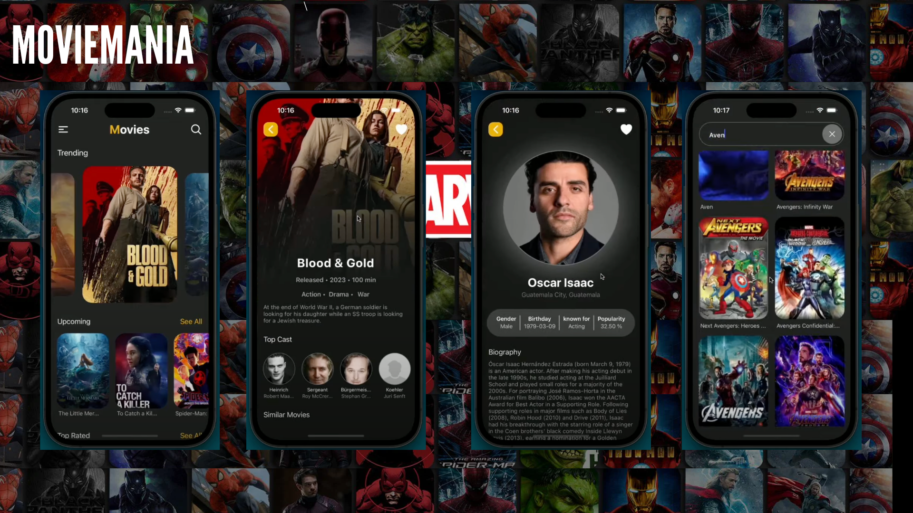

# MovieMania

MovieMania is a mobile application built with React Native that allows users to browse and search for movies using the TMDB API.

## App Preview




## Installation

1. **Clone the repository**:
   ```bash
   git clone https://github.com/lokeshdarla/moviemania.git
   cd moviemania
   ```

## Features

- Browse popular movies
- Search for movies
- View movie details including ratings, synopsis, and more
- View actor details including acted movies.

## Usage

1. **Home Screen**: Displays popular movies.
2. **Search Screen**: Allows users to search for movies by title.
3. **Movie Detail Screen**: Displays detailed information about a selected movie.
4. **Actor Detail Screen**: Displats detaied information about a selected actor.

